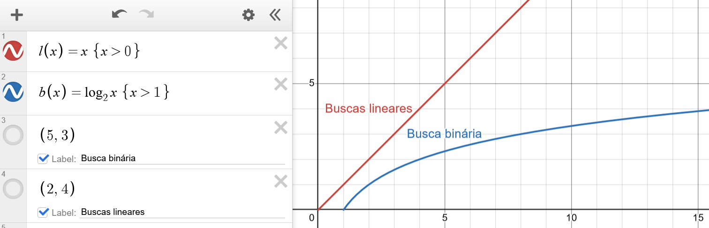

# Análise assintótica de algoritmos de busca

## Busca linear

**Pior caso:** item não pertence ao array.

O programa verificará cada índice, um por um, até concluir que não há um correspondente.

**Total:** $O(n)$

## Busca linear ordenada

**Pior caso:** item está na última posição.

O programa verificará cada índice, um por um, até chegar ao último espaço de memória. Neste caso, o valor não pertencer ao array representa duas possibilidades: $x > max(A)$, onde o programa também terá que fazer uma varredura completa, ou $x < min(A)$, onde haverá uma saída imediata ao verificar o primeiro índice.

**Total:** $O(n)$

## Busca binária

**Pior caso:** valor está em um índice ímpar.

O array será subdividido $\lceil\log{n}\rceil$ vezes, sem a possibilidade de encontrar $x$ no meio do caminho. Na maioria dos casos, será um pouco menos do que $\log{n}$, mas dificilmente algo abaixo da curva.

**Total:** $O(\log{n})$

---

