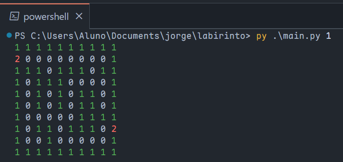
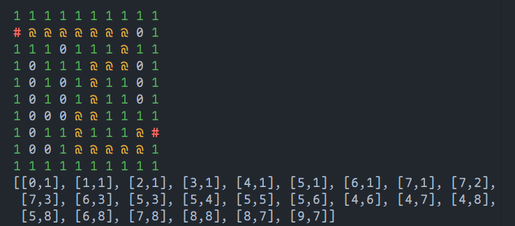

# Explorador de labirintos

## Sobre o projeto

Este repositório é referente à atividade avaliativa N3 de Estruturas de Dados na _Fatec São Caetano do Sul_. Recebemos como proposta a elaboração de uma situação problema que utilizasse diversos loops e recursividade na sua solução. Nos organizamos em quartetos, onde uma dupla resolveu a situação com recursividade e a outra com um algoritmo iterativo.

## Integrantes

- [Breno Saraiva](https://github.com/BrenoSaraiva-exe)
- [Jorge Terence](https://github.com/JorgeTerence)
- [Rodrigo Zanetti](https://github.com/RodrigoZanetti175)
- [Vinicius Crozato](https://github.com/ViniciusCrozato)
- @ViniciusCrozato _teste_

## Interação com o programa

Este repositório foi dividido em diversos arquivos para várias demonstrações do algoritmo. Chamando `main.py` no terminal, é possível carregar um mapa salvo no computador e gerar um caminho que ligue os pontos de entrada e saída.

```sh
python main.py 1 # carrega o mapa localizado em `maps/01.txt`
```

### Entrada

Um mapa é uma matriz trinária. `0` representa um espaço em branco, onde é possível atravessar. `1` representa uma barreira; formam as paredes do labirinto. `2` marca os pontos de entrada e saída do labirinto.

```txt
1111111111
2000000001
1110111011
1011100001
1010101101
1010101101
1000001111
1011011102
1001000001
1111111111
```

Ao dar início, o programa lê o arquivo do mapa e realiza a conversão do texto através de uma compreensão de lista:

```python
m = [[int(c) for c in line if c != "\n"] for line in file.readlines()]
```

Definimos as funções `print_map` e `print_path` para a visualização das variáveis com cores:



### Saída

O caminho entre os pontos de entrada e saída pode ser representado com uma lista de coordenadas matriciais. 



## Uma nova perspectiva

Podemos mudar nossa visão e encarar o mapa como um grafo, com os pontos `0` como vértices e as arestas são formadas entre vértices vizinhos. Assim, o problema se torna um algoritmo de travessia de grafo.

`TODO: animação vem aqui`

## Partes da solução

### Função [`navigate`](https://github.com/JorgeTerence/labirinto/blob/main/main.py#L60)

#### Parâmetros

- **Mapa:** matriz bidimensional, ou seja, uma lista de listas;
- **Raiz:** coodenada de partida do caminho;
- **Destino:** a coodenada que o programa está buscando;
- **Atual:** a coodenada atual no estado da busca; por padrão é igual à raiz;
- **Caminho:** coleção de pontos que levam à coodenada atual; por padrão é uma lista de tuplas vazia.

#### Retorno

Caso o algoritmo alcance o destino, ele retorna o caminho acumulado até o estado atual. Isso é propagado ao longo da pilha de memória, chegando a chamada original da função.

Caso uma chamada de navigate não encontre mais nenhum movimento possível, ele retorna `False`. Isso é propagado para a sua chamada mãe, que prossegue para outra direção, ou, caso todas as direções sejam exaustivamente exploradas sem resultados, propaga novamente o resultado negativo. Isso permite o _backtracking_ do algoritmo.

Se o sinal alcançar a chamada original, significa que todos os caminhos possíveis foram explorados e não há solução possível.

Um adendo: o resultado positivo da função não necessariamente é o caminho otimizado. Isso acontece pois a função de verificar arredores verifica na ordem "cima, baixo, direita, esquerda", portanto, por exemplo, se houver um solução saindo para cima da raiz e outra para baixo, mesmo que a solução seguindo para baixo seja um caminho menor, a de cima será a solução encontrada. Para resolver isso seria necessário verificar todas as soluções possíveis, e então determinar qual caminho é o menor.

### Função [`bounded`](https://github.com/JorgeTerence/labirinto/blob/main/main.py#L56)

#### Parâmetros

- **Ponto:** uma coordenada relacionada à um ponto que está ao redor de um ponto o qual está sendo investigado.
- **Mapa:** matriz bidimensional, ou seja, uma lista de listas;
- **Height:** a altura da matriz;
- **Width:** a largura da matriz;

#### Retorno

Se o ponto verificado atender aos requisitos, será retornado `true`, representando que o ponto é percorrível, caso
não não seja percorrível, será retornado `false`.

As condições para que ele seja um ponto percorrível são que ele esteja dentro dos limites da matriz, ou seja, a coordenada `x` do ponto seja entre 0 e a largura da matriz, assim como a coordenada `y` deve ser de um valor entre 0 e a altura da matriz. Além disso, é necessário que o valor guardado na posição do ponto seja 0, representando que é navegável.

Dessa forma, é possível verificar se um ponto está apto a ser adicionado ao caminho da solução.

### Função [`directions`](https://github.com/JorgeTerence/labirinto/blob/main/main.py#L56)

#### Parâmetros

- **Ponto:** uma tupla de tuplas, os valores das tuplas representarão as quatro direções em volta de um ponto investigado

#### Retorno

Esta função retorna os pontos ao redor de uma coordenada em que se deseja buscar possíveis rotas à se tomar a partir desta coordenada. A função tem o objetivo apenas de retornar os pontos dos arredores.

Para fazer isso, a função utiliza os valores das coordenadas x e y, subtraindo ou adicionando 1 à esses valores:

- `Point(p.x, p.y - 1):` Mover-se para cima.


